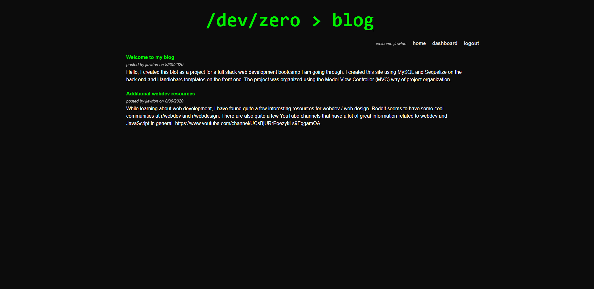

  # /dev/zero > blog - A tech blog using MVC

  

  ## Description
  This is a CMS for a tech blog website that I created using MVC. The blog allows users to create accounts and log in where they can then create new blog posts or comment on existing ones.Logged in users can also edit or delete their own posts. Users do not need to be logged into read blog posts.

  ## Live link
  [Heroku Link](https://fast-caverns-43047.herokuapp.com/)

  

  ## Table of Contents
  * [Description](#description)
  * [Installation](#installation)
  * [Usage](#usage)
  * [License](#license)
  * [Contribution](#contribute)
  * [Tests](#tests)
  * [Questions](#questions)

  ## Installation
  There are no installation instructions for this site, it is currently being hosted on Heroku and may be accessed there. If you wanted to run your own version of the blog / CMS, you would need to first clone this repository, then create a MySQL database that could be used with Sequelize for running the back end. Once that is done, you can launch the application locally with npm start and  from there navigate to the site using your browser.

  ## Usage
  Browse to the blog's URL. If it is your first time visiting, you will need to register for an account. Once you are registered / logged in, you can browse and comment on existing blog posts or create your own.

  ## License
  This software is licensed under the [MIT license](https://choosealicense.com/licenses/mit/).

  ## Contribution
  This project follows the guidelines of the [Contributor Covenant](https://www.contributor-covenant.org/version/2/0/code_of_conduct/). If you are interested in contributing, please contact me at my email in the Questions section of this README.
    

  ## Tests
  No test instructions for this project

  ## Questions
  If you have any questions about this project, you can email me at joe.lawton@outlook.com.
  For other projects, check out my [GitHub](https://github.com/jdlawton).
